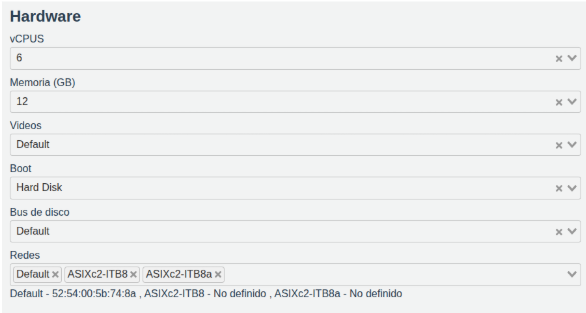
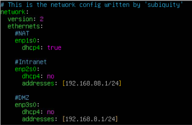
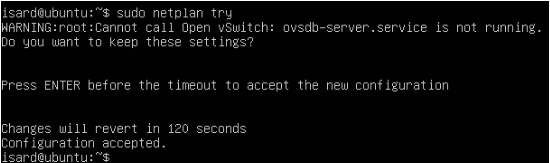
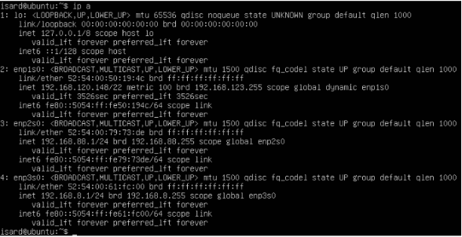
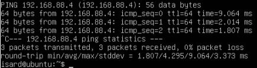
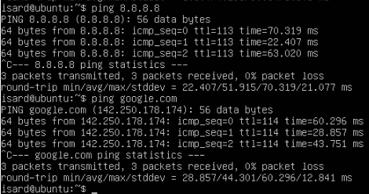
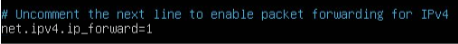

**Instalación y configuración del router**  
**(Ubuntu server enrutador)**

**Índice**

1. Documentación router (creación y configuración)  
2. Configuración de la máquina virtual (router)  
3. Convertir la máquina virtual en un enrutador funcional

	3.1 Paso 1: Habilitar el IP Forwarding  
	3.2 Paso 2: Configurar NAT (Masquerading)  
	3.3 Paso 3: Configurar Firewall  
	3.4 Paso 4: Guardar las reglas IPTables

4. Instalación SSH

**Documentación router (creación y configuración)**

**Objetivo:** Crear una máquina virtual que haga de router tanto para los servidores como para los clientes dentro del esquema de red.

**Especificaciones:** 

- Máquina creada en la nube (Isard VDI)  
- Sistema operativo: Ubuntu server 22.04 

**Hardware:**
|  |
| :---- |

**Explicación redes:** 

- Default: Adaptador de red que hará de red **NAT**  
- ASIXc2-ITB8: Adaptador de red que hará de red **INTRANET**  
- ASIXc2-ITB8a: Adaptador de red que hará de red **DMZ**

**Tabla de IPs del router**

| NAT | DHCP |
| :---- | :---- |
| **INTRANET** | 192.168.88.1 |
| **DMZ** | 192.168.8.1 |

**Configuración de la máquina virtual (router)**

**Configuración netplan:**

En la configuración de red, el primer adaptador será DHCP, ya que se ha de poder conectar a internet. El segundo adaptador dará la conexión intranet, le aplicaremos una IP estática. De la misma manera, el tercer adaptador dará la conexión DMZ, por lo que también le daremos IP estática. Previo a la configuracion:  sudo apt update sudo apt upgrade  Archivo netplan:
|  |
| :---- |

Correcta aplicación de la configuración: sudo netplan try
|  |
| :---- |

Comprobamos aplicando el comando ip a:
|  |
| :---- |

Comprobación de que se ve con las otras máquinas virtuales dentro de la red: ping Ejemplo: servidor DNS/DHCP 
|  |
| :---- |

Ejemplo 2: comprobando la salida a internet
|  |
| :---- |

**Convertir la máquina virtual en un enrutador funcional**

**Paso 1: Habilitar el IP Forwarding**  
Esto le permitirá a nuestra máquina poder reenviar un tráfico como lo haría un router

Editar el archivo sysctl.conf dentro de /etc. 
Quitandole la “\#” a la linea “\#net.ipv4.ip\_forward=1”:
|  |
| :---- |

Guardamos el cambio y lo aplicamos con el comando sudo sysctl \-p: ![][image8] Comprobamos si el cambio se ha aplicado con el comando  cat /proc/sys/net/ipv4/ip\_forward ![][image9] (el 1 nos indica que el cambio ha sido exitoso). |
| :---- |

**Paso 2: Configurar NAT (Masquerading)**

Esta configuración les permitirá, a nuestras redes internas, salir a internet, traduciendo las direcciones IP.

| Por si acaso Ejecutaremos el comando sudo iptables \-t nat \-F para eliminar posibles reglas NAT que puedan interferir. Ejecutamos el siguiente comando para que el router enmascara todo paquete que quiera salir a internet: sudo iptables \-t nat \-A POSTROUTING \-o enp1s0 \-j MASQUERADE Verificamos con el comando sudo iptables \-t nat \-L \-v \-n ![][image10]  |
| :---- |

**Paso 3: Configurar Firewall**  
Esta configuración bloqueará todo el tráfico no permitido que intente pasar a través del router.

| Políticas por defecto:  Para denegar todo el tráfico que pasa por defecto a través del router. sudo iptables \-P FORWARD DROP ![][image11] Para denegar el tráfico por defecto que llega internamente al router. sudo iptables \-P INPUT DROP ![][image12] Para permitir todo el tráfico que genera el propio router (ejemplo: Actualizaciones). sudo iptables \-P OUTPUT ACCEPT ![][image13] Permitir tráfico básico y establecido: Importante: se ha de ejecutar el comando “sudo iptables \-A INPUT \-m state \--state ESTABLISHED,RELATED \-j ACCEPT”  ![][image14] y el comando “sudo iptables \-A FORWARD \-m state \--state ESTABLISHED,RELATED \-j ACCEPT”  ![][image15] Para... Add task ... Add task ... Add task  permitir las conexiones establecidas y poder continuar con la configuración.  Permitir tráfico loopback (comunicación interna del router). sudo iptables \-A INPUT \-i lo \-j ACCEPT ![][image16] Permitir acceso de administración (como SSH y ping) desde la red interna. (PING \- ICMP) sudo iptables \-A INPUT \-i enp2s0 \-p icmp \-j ACCEPT ![][image17] (SSH \- PUERTO 22\) sudo iptables \-A INPUT \-i enp2s0 \-p tcp \--dport 22 \-j ACCEPT ![][image18] Reglas de enrutamiento (FORWARD) Definición de flujo de tráfico entre redes. Permitir INTRANET → INTERNET. sudo iptables \-A FORWARD \-i enp2s0 \-o enp1s0 \-j ACCEPT ![][image19] Permitir INTRANET → DMZ. (Para que los clientes puedan “consumir” los servicios). sudo iptables \-A FORWARD \-i enp2s0 \-o enp3s0 \-j ACCEPT ![][image20] Permitir DMZ → INTERNET. (Para permitir a los servicios buscar actualizaciones, etc.). sudo iptables \-A FORWARD \-i enp3s0 \-o enp1s0 \-j ACCEPT ![][image21] Denegar DMZ → INTRANET. (Regla clave de seguridad) sudo iptables \-A FORWARD \-i enp3s0 \-o enp2s0 \-j DROP ![][image22] |
| :---- |

**Paso 4: Guardar las reglas IPTables**

| Comando de instalación netfilter-persistent. sudo apt install netfilter-persistent \-y ![][image23] Comando para guardar las reglas de iptables para que se carguen automáticamente al arrancar.  sudo sh \-c 'iptables-save \> /etc/iptables/roule.v4' ![][image24] Las reglas estarán guardadas en la siguiente ruta: /etc/iptables/rules.v4 En el caso de no tener el directorio iptables, lo creamos y después ejecutamos el comando. ![][image25] Podemos verificar que todas las reglas están aplicadas con el comando sudo iptables \-L ![][image26] Por último, editaremos el siguiente archivo para que las reglas se apliquen al encender la máquina. sudo nano /etc/systemd/system/iptables-load.service ![][image27] Habilitamos y probamos. Recargar la configuración de systemd: sudo systemctl daemon-reload  Habilitamos servicio:sudo systemctl enable iptables-load.service Cargar las reglas inmediatamente: sudo systemctl start iptables-load.service  ![][image28] Verificamos que las reglas estén cargadas: sudo iptables \-L \-n \-v ![][image29]   Reboot a la máquina y verificamos que se apliquen automáticamente después de arrancarse: sudo reboot sudo iptables \-L \-n \-v ![][image30] |
| :---- |

**Instalación SSH**   
La instalación de este servicio es para poder conectarnos al router desde otra máquina con las credenciales de un usuario verificado.

| Ejecutamos el comando sudo apt update y sudo apt install openssh-server. ![][image31] Para verificar que ya está instalado ejecutaremos el siguiente comando: sudo systemctl status ssh ![][image32] Por último intentaremos conectarnos a nuestros router desde una máquina cliente. ![][image33] |
| :---- |

