---

# 🔗 Índice del Documento 

* [1. Configuracion general](#configuración-general)
* [2. Servidor DNS](#Servidor-DNS)
    * [Comprobaciones DNS](#Comprobaciones-DNS)
* [3. Servidor DHCP](#Servidor-DHCP)
    * [Solución de Problemas y Logs](#Errores)
    * [Configuración del Servicio (dhcpd.conf)](#Configuración)
    * [Comprobaciones DHCP](#Comprobaciones-DHCP)
* [4. Servicio SSH](#Servicio-SSH)
* [5. Notas Finales](#Notas)

---

# **Configuración general**

Primero, como se nos pide en la práctica, crearemos el usuario bchecker, con su contraseña   
**cat /etc/passwd | grep checker** 

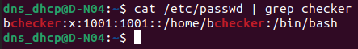  

Hacemos un update  
**sudo apt update** 

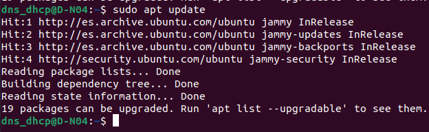  

En este caso, las máquinas venían con muchas cosas que no estaban instaladas, por tanto, ahora indicaré los comandos o programas que he tenido que utilizar/instalar para el correcto funcionamiento de la máquina  
**sudo apt install iputils-ping** para el ping  

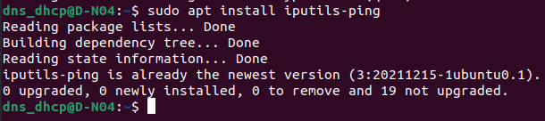

# 

# **Servidor DNS**

## **Configuración**

Para configurar el servidor DNS primero instalamos los paquetes necesarios

| sudo apt install bind9 bind9utils bind9-doc \-y |
| :---- |

Luego en el archivo de configuracion de zonas /etc/bind/named.conf.local agregamos la siguiente zona  

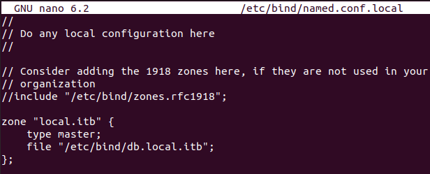  

Copiamos el fichero de configuración

| sudo cp /etc/bind/db.local /etc/bind/db.local.itb |
| :---- |

Y aplicamos la siguiente configuracion  

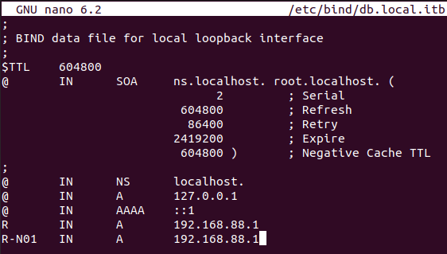  

Comprobamos que la configuracion este correctamente y reiniciamos el servicio

| sudo named-checkconf sudo named-checkzone local.itb /etc/bind/db.local.itb sudo systemctl restart bind9 sudo systemctl enable bind9 |
| :---- |

## **Comprobaciones**

### **Server**

Instalamos las utilidades del dns

| sudo apt install dnsutils \-y |
| :---- |

Una vez instaladas, procedemos a  hacer las comprobaciones  
**NSLOOKUP** 

**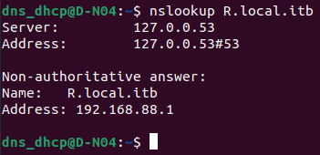** 
**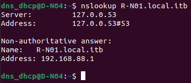** 
**DIG** 
**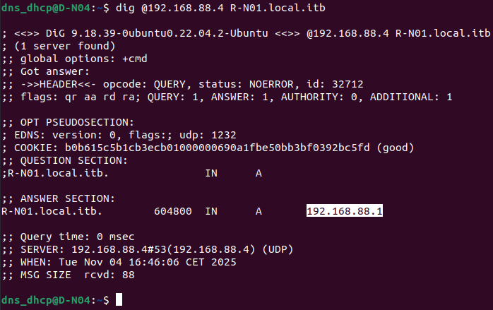** 
**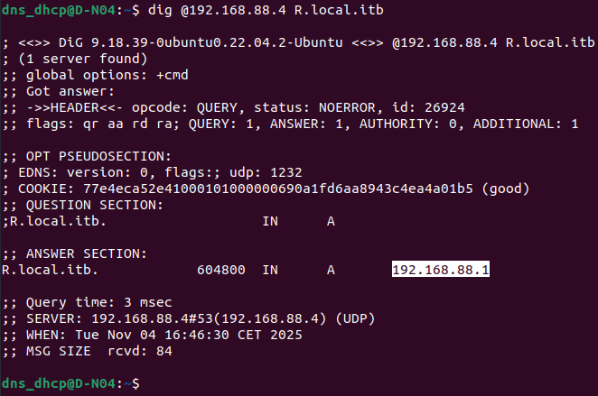**

### **Cliente**

dig  
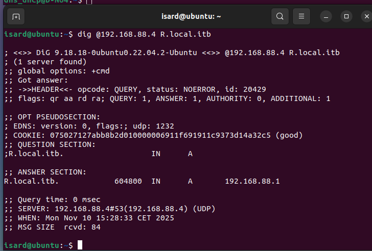  
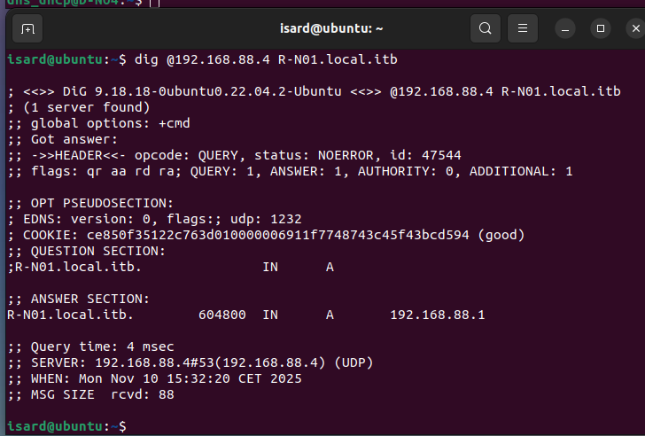  
nslookup  
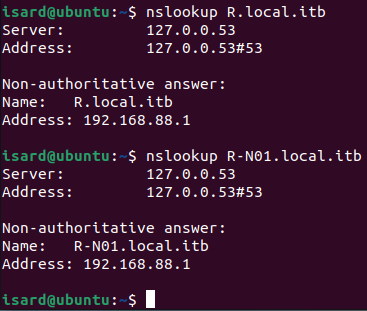

ping  
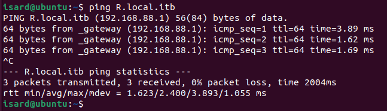  
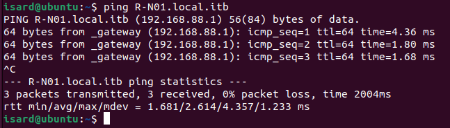

# **Servidor DHCP**

## **Errores**

A la hora de instalar el isc-dhcp-server ha habido varios problemas, ya que el servicio siempre se mostraba como failed, y no lograba ubicar el fichero de logs porque no existía.  
Estos han sido los pasos que he seguido para solucionar el problema.  
En el fichero de configuración /etc/dhcp/dhcpd.conf he habilitado la siguiente linea para que redirigiera 
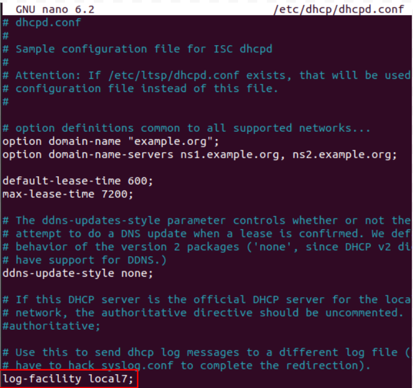  
Después cree el siguiente fichero con la ruta a la que debería de apuntar local7, ya que no existía el fichero de configuración en syslog  
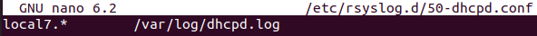  
Tampoco tenía instalado rsyslog, por lo que use los siguientes comando

| sudo apt install rsyslog sudo systemctl enable rsyslog sudo systemctl start rsyslog |
| :---- |

Después de eso, reinicie los servicios de syslog y dhcp con los siguientes comandos

| sudo systemctl restart rsyslog sudo systemctl restart isc-dhcp-server |
| :---- |

Después ya me funciono correctamente 

## **Configuración**

En el fichero de configuración /etc/dhcp/dhcpd.conf añadi las siguientes lineas  
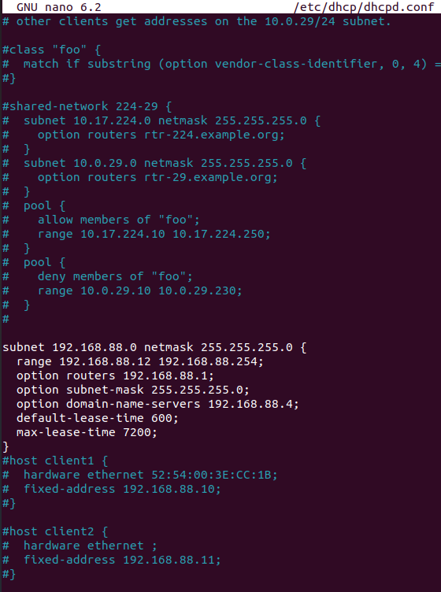  
Esta seria la configuración del servicio dhcp que asignaría IP dinámicamente desde la 192.168.88.12 hasta la 192.168.88.254, reservando las primeras para equipos específicos.  
**Reservas de IP** 192.168.88.1 – 192.168.88.10: Servidores y routers  
192.168.88.11 – 192.168.88.12: Dispositivos con IP estática  
192.168.88.13 – 192.168.88.254: Asignación dinámica (DHCP)  
**Parámetros del DHCP** **Gateway (router)**: 192.168.88.1  
**Máscara de subred**: 255.255.255.0 (/24)  
**Servidor DNS**: 192.168.88.4  
**Tiempo de concesión** (lease time): 600 ms (por defecto)  
**Tiempo máximo de concesión**: 7200 ms

**Pasos finales** Guardar la configuración.  
Reiniciar el servicio DHCP con el siguiente comando:

| systemctl restart dhcpd |
| :---- |

Y con esto el servidor DHCP quedará configurado correctamente.

## **Comprobaciones**

Para comprobar que funciona correctamente, en una máquina cliente hemos asignado la interficie correspondiente para que adquiera la configuración del servidor dhcp.  
Con el siguiente comando renovamos la ip

| sudo dhclient \-r enp0s3 |
| :---- |

Y en la configuración de la interficie podemos que ha recibido correctamente los parámetros  
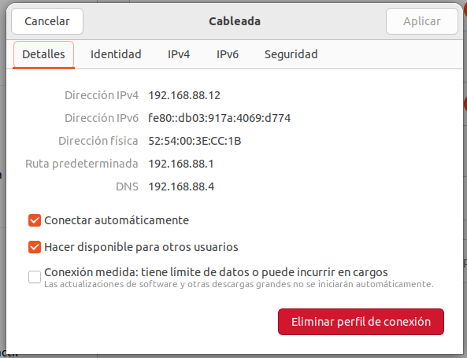

Y para comprobar el funcionamiento de la IP estática, habilitamos el siguiente parámetro  
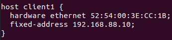  
Reiniciamos el servicio dhcp, y renovamos la IP del cliente.  
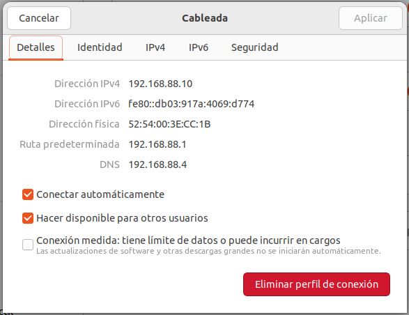  
Y ahora tiene la IP 192.168.88.10

# **Servicio SSH**

## **Instalación**

Para instalarlo tenemos que utilizar el siguiente comando

| sudo apt install openssh-server |
| :---- |

## **Comprobación**

Para comprobar que funciona correctamente, nos conectamos al servidor desde el cliente.  
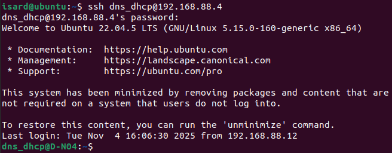

## **Notas:**

Se ha hecho una copia de seguridad de todos los ficheros de configuracion por si acaso.
