**Grupo 8									18/11/2025**

**Servidor Web \+ FTP**  

**Índice:** 

1. Creación de usuario y actualización e instalación del servicio web  
2. Creación de la página web y sus permisos:  
3. Instalación del servicio FTP  
4. Configuración del servicio FTP  
5. Instalación y configuración SSH  
6. Webgrafía

**Manual:**  
**Creación de usuario y actualización e instalación del servicio web:**  
Creación del usuario del servidor Web y asignación de permisos:

Usuario creado para realizar configuraciones y tareas que se necesiten permisos elevados (también tenemos el usuario isard para ello):

| 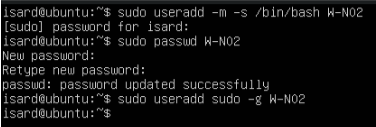 |
| :---- |

| 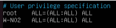 |
| :---- |

**Usuario Global:**
Este usuario estará en todos los servidores que hagamos para poder acceder a ellos
| 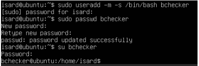 |
| :---- |

Actualización de paquetes e instalación de estos:

| 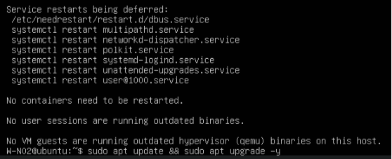 |
| :---- |

Instalación de Nginx (Servidor Web) y verificación de su estado:

| 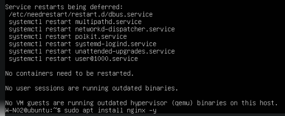 |
| :---- |

| 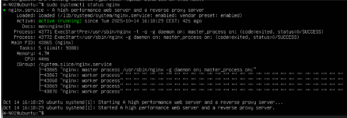 |
| :---- |

**IMPORTANTE**: Aplicaremos el siguiente comando para que el servicio Nginx inicie automáticamente con el sistema:

| 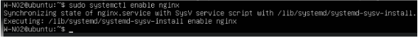 |
| :---- |

**Archivos principales de Nginx:**  
**Configuración principal:** /etc/nginx/nginx.conf  
**Sitios disponibles:** /etc/nginx/sites-available/  
**Sitios habilitados:** /etc/nginx/sites-enabled/

**Creación de la página web y sus permisos:**  
Creación del sitio:

| 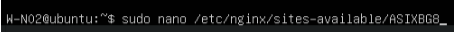 |
| :---- |

| 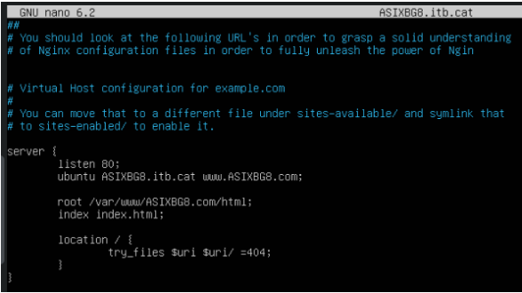 |
| :---- |

**Creación del archivo HTML:**

| 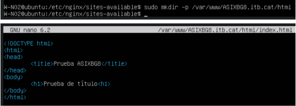 |
| :---- |

| 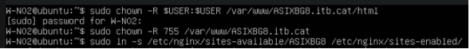 |
| :---- |

Asignación de permisos y creación del enlace simbólico para habilitar el sitio:

| 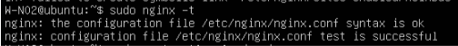 |
| :---- |

Verificación de la sintaxis del archivo de configuración:

| 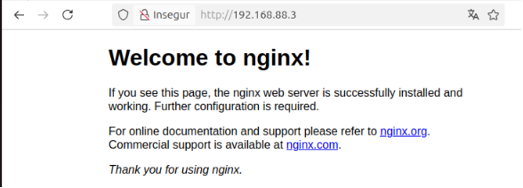 |
| :---- |

Verificación del correcto funcionamiento del servicio:

| 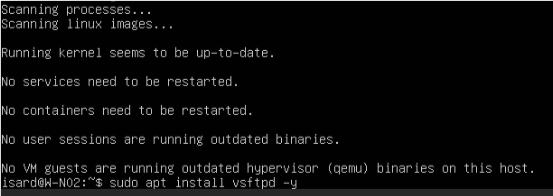 |
| :---- |

**FTP:**  
**Instalación del servicio FTP**

| 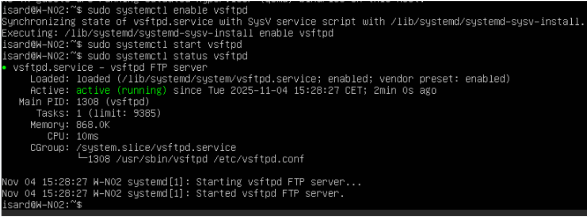 |
| :---- |

**Configuración del servicio FTP:**

| 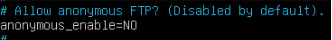 |
| :---- |
**systemctl enable vsftpd** sirve para que el servicio se inicie cada vez que inicie el sistema, por otro lado, **systemctl start vsftpd** tiene la función de activar el servicio en el momento que lo ejecutas y por último **systemctl status vsftpd** nos mostrara el estado del servicio. 

**Archivo principal de Vsftpd:**  
Configuración principal: /etc/vsftpd.conf

**Parámetros importantes para el correcto funcionamiento del servicio:**

| 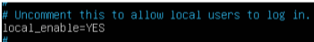 |
| :---- |
Al configurar el parámetro en “NO” deshabilitamos el acceso al sistema FTP mediante usuario anónimo 

| 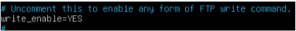 |
| :---- |
Al configurar el parámetro en “YES” permitimos el acceso de usuarios locales del sistema al servicio 

| 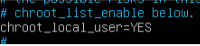 |
| :---- |
Permitimos subir archivos mediante el protocolo FTP 

| 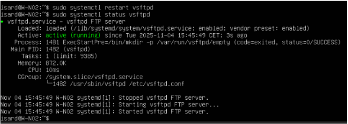 |
| :---- |
Restringimos al usuario solamente poder estar en su home, esto debido a que no queremos que los usuarios se muevan a carpetas propias de otros usuarios 

**Aplicamos los cambios realizados:**

| 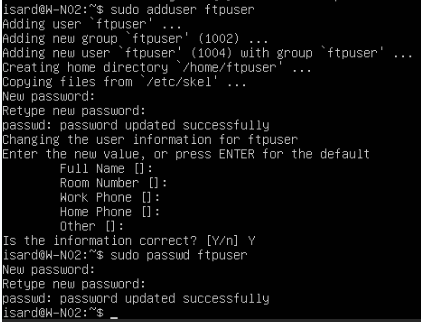 |
| :---- |
Aplicamos los cambios realizados con el comando systemctl restart vsftpd

**Creación de un usuario FTP y su directorio:**

En este apartado crearemos un usuario exclusivo para el servicio FTP.
| 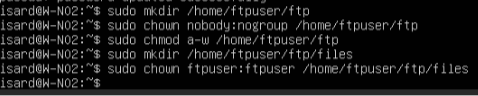 |
| :---- |
Usuario: ftpuser Contraseña: ftpuser 

Y una vez está creado el usuario nos faltará crear su directorio para que pueda subir archivos
| 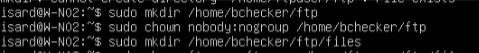 |
| :---- |

Además del usuario creado, también podremos utilizar el usuario general para poder conectarnos al servicio FTP (bchecker)
|  |
| :---- |

| 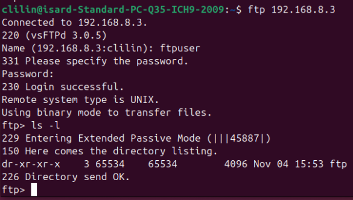 |
| :---- |

**Verificación del funcionamiento del servicio (con los 2 usuarios):**

| 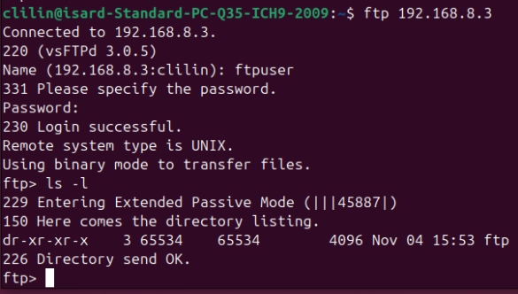 |
| 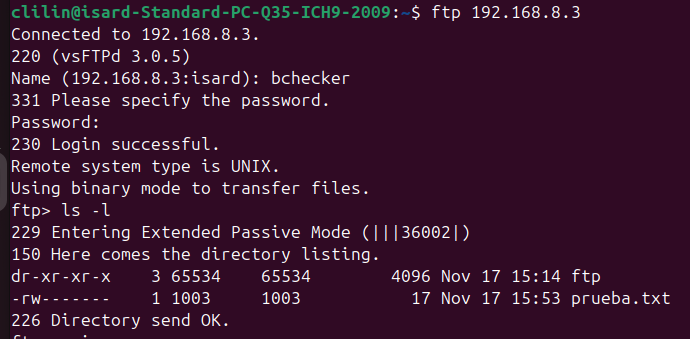 |

**SSH:**  
**Instalación y configuración SSH:**

Tener instalado el servicio SSH nos servirá para poder conectarnos remotamente al servidor por una vía segura.

| 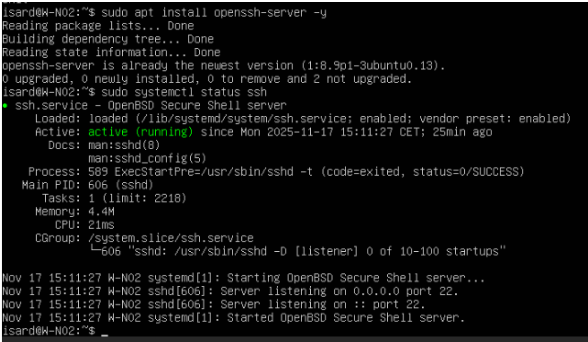 |
| :---- |

Verificación del funcionamiento del servicio SSH: Una vez instalado el servicio probaremos a conectarnos a nuestro servidor para comprobar que todo se ha instalado y configurado correctamente.

| 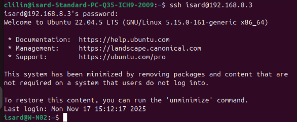 |
| :---- |

**Webgrafía:**

| [https://cloudoli.ar/como-instalar-nginx-en-linux-ubuntu-22-04-y-probar-su-funcionamiento/](https://cloudoli.ar/como-instalar-nginx-en-linux-ubuntu-22-04-y-probar-su-funcionamiento/) [https://www.geeksforgeeks.org/linux-unix/setup-and-configure-an-ftp-server-in-linux/](https://www.geeksforgeeks.org/linux-unix/setup-and-configure-an-ftp-server-in-linux/) [https://www.brandonrohrer.com/ssh\_at\_home](https://www.brandonrohrer.com/ssh_at_home) |
| :---- |
